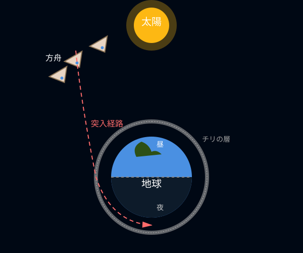
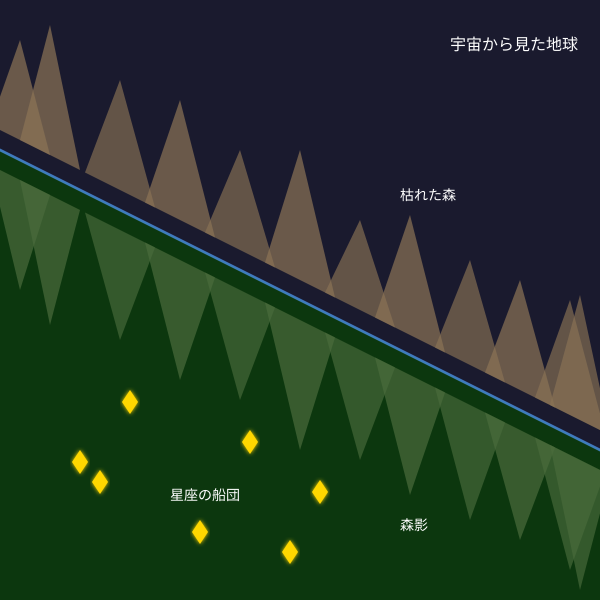
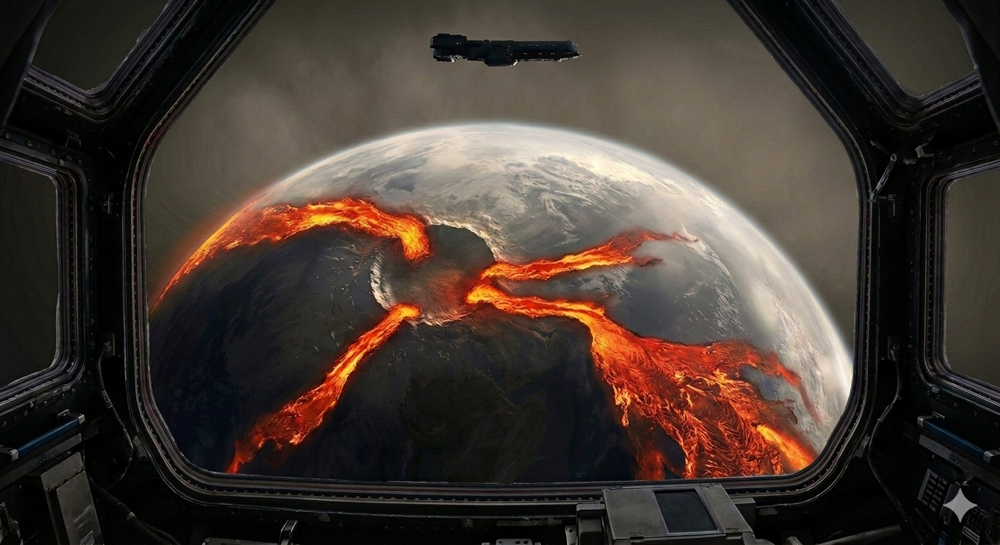

# はじめに

この文書は大岡信が作詩した「方舟」の久保田なりの解釈をまとめたものです。詩の解釈に正解はなく、あくまで私案ですが、作詩された当時の時代背景を調べながら、詩全体の解釈が整合的であることを心がけて考察しました。木下牧子作曲の「方舟」を表現する上での参考になれば幸いです。最初に結論を記しますが、この詩は

**核戦争の悲惨さや愚かさへの嘆き・反省と、一方で軍事技術の発展で解き明かされてゆく「宇宙」という未知への抗えない好奇心、そしてその二つの感情の葛藤を描いている**

と解釈しています。また一見抽象的で何を表しているか分からない表現が多いと感じますが、実はすべて核戦争後の地球の姿を写実的に表現しているのだと思います。

# 作詩当時の時代背景

大岡信が方舟を書いたのは1951年（またはそれより前）頃のことです（[大岡信の年譜](https://ookamakotokenkyu.verse.jp/?page_id=385)）。1931年生まれの彼は当時20歳、東京大学国文科の生徒でした。この頃の日本はご存じの通り激動の時代です。1945年に広島・長崎に核爆弾が投下されて終戦に至り、日本は深い傷を負い悲しみのどん底にありました。しかしそこから人々は這い上がり、わずか5年後の1950年頃には高度経済成長を迎えるほどの急激な復興・発展を遂げます。彼の青春はまさにその時代の真っただ中にありました。

一方その頃、アメリカとソ連は1945年ごろから冷戦に突入し、互いに軍事技術開発を加速させ、その一環として宇宙開発が始まります。その中で1946年のアメリカは、ドイツ製の弾道ミサイル「V2」にカメラを搭載し、宇宙から地球を撮影することに人類で初めて成功しました。モノクロながら、広大な大地や空が丸みを帯びた一つの星として観測された[この写真](https://ja.wikipedia.org/wiki/V2%E3%83%AD%E3%82%B1%E3%83%83%E3%83%88#%E3%82%A2%E3%83%A1%E3%83%AA%E3%82%AB%E3%81%A7%E3%81%AE%E5%88%A9%E7%94%A8)は当時の日本でも雑誌や新聞で大々的に取り上げられ、SFが現実のものになったと大いに話題になったそうです。おそらくこの「宇宙から見た地球」に衝撃を受けたことが方舟という詩を書くきっかけの一つになったのではないか、と考えています。

# 詩中の地球に起きていること

詩の細かい考察に入る前に、地球に何が起きているかを明らかにしておきます。まず、人類が方舟に乗って地球を脱出せざるを得なくなった最大かつ直接的な原因は、**核爆弾**です。後ほど詳しく書きますが、詩の中盤にある「憎悪の暗い洞穴」が核爆弾（＝憎悪）の激しい爆発で地球に空いたクレーターです。

また、この詩の中には水に関係する表現がいくつか登場するので着目します。まず「河は涸れ」ています。これはたまたま一つの河が涸れたわけではなく、地球全体で起きている現象の描写だと思います。しかし一方で「海は鏡のように光る」ほどきれいで、「湖水」もあります。海や湖はあるのに河は涸れている。これが何を意味しているかというと、つまり雨が降らなくなってしまったのです。

実は核爆弾によって雨が降らなくなる現象が予見されています。それは[核の冬](https://ja.wikipedia.org/wiki/%E6%A0%B8%E3%81%AE%E5%86%AC)という現象です。核爆弾によってはるか上空に巻き上げられた大量のチリが地球を覆い隠し、太陽光を遮断してしまいます。その結果、地球は急激に冷え込み、上昇気流が止まり、水が蒸発せず雲ができないため雨が降らなくなります。つまり、地球は

**チリに覆われ、気温が急激に下がり、大気の循環が止まり、雨が降らない**

世界になっています。ちなみに補足ですが、核の冬という概念の提唱は1980年の出来事です。しかしSF作家の世界ではポール・アンダーソンという作家が1947年に短編小説『Tomorrow's Children（明日の子供たち）』の中でこの現象を予見しているようで、大岡信の発想はここから来ていると推測します。さらに余談ですが小説内では[フィンブルの冬](https://ja.wikipedia.org/wiki/%E3%83%95%E3%82%A3%E3%83%B3%E3%83%96%E3%83%AB%E3%81%AE%E5%86%AC)と呼ばれていて、これは北欧神話で世界の終わりの日であるラグナロクの前兆となる出来事を示すそうです。

# 詩の考察

ここからは詩を一文ずつ説明していきます。

### 空を渡れ 錨をあげる星座の船団

複数の宇宙船が地球を離れ宇宙へ旅立とうとしています。船団ですので一隻ではなく複数です。また「星座の」はこの宇宙船がそれぞれ光っているので遠くから見るとまるで星座のように見える、という見た目を表しているのだと思います。また星座は多くの国で全部で88個なので、宇宙船の数が大体それくらいなのかもしれません。

### 灯火は地球に絶えた 悲愁は冷たく迅やかだ

灯火はヒトが生活のために灯す火で、それが絶えているので直接的な意味は「地球上の人類は全員死に絶えた」です。方舟に乗っている人々が人類最後の生き残りです。悲愁は悲しみに深く心が落ち込む様子を表しますが、それが「冷たく迅やか」です。迅やかは歌詞ではひらがななので、「澄みやか（＝透明できれい）」と思い違いをするかもしれませんが、迅やかの意味は「短時間で物事が進行する様子」です。口語的には「さっさと」なので、「悲愁は冷たくさっさと」です。つまり、冷たいことに、方舟の人々は早くも悲愁を感じていないようです。

### 湖水の風に羽を洗う鳥たちはむなしく探す

湖水の風は湖の周りを吹く風で、陸と水の寒暖差からそよそよと吹きます。大気の循環は止まっても、局所的な弱い風は吹くようです。ここでの疑問は「湖があるのになぜ鳥たちは水浴びをせずに風に羽を洗うのか」です。おそらくこれは河が涸れたことで湖の水がよどんでいるからだと思います。そのため、鳥たちは何かを探しています。

### 昨日の空にはためいていた見えない河原を

「空にはためいていた見えない河原」の正体は雲です。地球には大きな水の循環があります。河は海に流れ、蒸発して雲となり、風に運ばれ雨となり、また河となって流れます。この河の流れが見える河原、雲の流れが見えない河原です。しかし先述の通り核の冬の影響でこの循環が止まり、空には雲がありません。ただ地球を覆うチリが見えるのみです。なので鳥たちは「雨を降らせる雲はどこへ行ったのだろう。雨が降れば水浴びができるのに。」とむなしく空を見上げているのです。

### ひとよ 窓をあけて空を仰ごう

ひとは方舟にしかいません。第二段落では視点が方舟内の人々の様子に切り替わります。窓をあけて上を見上げると、そこにはチリに覆われた地球があります。無重力なので、上に地球があります。宇宙船と地球の位置関係を図に示しておきます。今、宇宙船は地球を覆うチリの外側の昼側にいます。

**挿絵1：船団と地球と太陽の位置関係**

### 今宵ぼくらはさかさまになって空を歩こう

旅立つ前に美しい地球を一目見ようと、宇宙船団は夜側のチリの内側に突入しようとしています（＝今宵）。人々はその時に見えるであろう光景に思いを膨らませます。「さかさまになって空を歩こう」は宇宙での無重力状態を楽しむ人々の様子を表します。もう一つの意味もあり、それは後ほど説明します。

### 秘められた空 夜の海は鏡のように光るだろう

「秘める」は何かを内側に隠して見えなくするという意味です。胸に秘めた想い、というような使われ方をします。ここでは地球の空がチリで覆われ、外から見えなくなっていることを表します。地球では風がほとんど吹かなくなっているので、波が起きず、水面は真っ平です。なので「夜の海は鏡のように光る」のです。

### まとこ水に映る森影は 森よりも美しいゆえ

海の近くに森があり、鏡のような海には虚像（＝森影）が映ります。森はおそらく環境変動の影響で枯れています。鏡はありのままの姿を映しますが、宇宙から見るとあるものが映り込んで見えるため、森影が森よりも美しく見えます。それは「星座の船団」です。現実の空はチリに覆われてもはや星々は見えなくなってしまいましたが、宇宙から見ると森影の奥に自分たち星座の船団がまるでかつて見えた星空のように輝いて見えます。

**挿絵2：宇宙から見た森と、海面に映った森影**

ここでのキーワードは最後の「ゆえ」です。ゆえは理由を表す接続助詞で、「A（理由）ゆえB（結論）」の形で使われます。しかしこの文はゆえで終わっており、倒置法が用いられています。実は先にB（結論）が登場しているのです。では「ゆえ」がどこに係っているかというと、「さかさまになって歩こう」です。つまり「森影は森よりも美しいから、さかさまになって歩こう」ということになります。

どういうことかというと、さかさまになることで、先ほどの挿絵の上下が反転します。その結果、在りし日の美しい星空の幻想が「まこと」の姿になり、枯れた森は虚像へとなり下がります。つまり、彼らは自分たちが滅ぼした地球の現実から目を背け、過去の美しい幻想に浸ってから地球を去ろうとしています。要は現実逃避です。現実逃避して、宇宙の無重力を楽しみ、宇宙の旅に心が躍っています。

**挿絵3：さかさまになってみた森影**

### 夜の奥に胸を開いて歩み入れば

第三段落では実際に地球の夜側のチリの内側（＝夜の奥）に突入したときに目の当たりにするであろう光景が描かれます。「胸を開く」について、現代語の慣用句に「胸襟を開く」という一見近い言葉がありますが、これは嘘をつかず真実を述べるという意味でピンときません。古語を調べると「胸開く（むねあく）」という語があり、こちらが当てはまりそうです。意味は「心が晴れる。心配事がなくなり安心する様子。」です。つまり人々の本音は「地球に取り残されていたら死んでいたが、自分は方舟で脱出して助かった。ああ良かった。」です。

### 地球を彩る血の帯ははためくだろう

「灯火は地球に絶えた」ので、現代と異なり夜の地球に光るものはありません。雲がないので雷光すらない真っ暗闇です。にもかかわらず、地表には宇宙からでも分かる規模の鮮やかに光る血のような帯状のものがあります。これはマグマ（＝地球の血）です。核爆弾の威力は日本に投下されたものよりはるかに強力（数万倍～数億倍）だったのでしょう。地球が砕け、その裂け目からはマグマがどくどくと溢れ出し、その熱による陽炎（かげろう）でゆらめき、まるで血の帯がはためいているように見えます。

### 憎悪の暗い洞穴をゆさぶりながら

血の帯の描写を深める「～ながら」というフレーズが3つ続きます。先述の通り、「憎悪の暗い洞穴」は核爆弾という人間が生み出した憎悪の塊によって、全ての命が消し飛び（＝暗い）地球に刻まれた巨大なクレーターで、そのクレーターを中心に血の帯が広がります。マグマが噴き出すことでその近くは地震が起き、血の帯は暗い洞穴をゆさぶります。

### 夜のしじまにしたたりながら おらびながら

溢れ出すマグマの帯は夜のしじまに滴ります。「しじま」の意味は静寂ですが、ここでは音が無いというよりは「灯火（＝人命）」が無く暗いという意味だと思います。そして地球の血の帯はおらびています。「[おらぶ](https://onomichi-u.repo.nii.ac.jp/record/453/files/nic0913.pdf)」の意味は「大声で叫ぶ」で、特に古語では「叫ぶ」と書き「殺される間際や、病や怪我に苦しむ場合」に使われることが多いそうです。つまりここでおらびているのは地球で、人々は地球の断末魔を目撃します。

**挿絵4：宇宙から見る地球の惨状 (by生成AI)**

### この星がふるさとであるか 血は血を泛べ

想像以上の惨状に、人々もさすがに現実を直視します。「血は血を泛べ」は次から次へとあふれ出るマグマの様子に、血で血を洗う争いを繰り返してきた人間の歴史を重ねています。

### この星がふるさとであるか 河は涸れ……

冒頭で説明した通り、核の冬の影響で河が涸れています。ここで河は命の循環にたとえられ、それが失われたことを嘆いているのだと思います。

### 鳩たちが明るい林を去ってからすでに久しい

平和の象徴である鳩が去ってから「久しい」です。つまり取り返しがつかない核戦争が行われるずっと前から、人間が争いを始めた時点で平和は失われる運命にあったのだ、と解釈できます。

### 愛するものよ おまえの手さえ失いがちに

ここまでの解釈をまとめます。第1・2段落では、核戦争の結末から目を背け、反省せず、宇宙への好奇心に心躍らせる気持ちが描かれています。一方、第3・4段落では逆に現実を直視し、戦争の歴史を顧みて嘆く気持ちが描かれているのです。この相反する感情はおそらく誰の心にもあるものです。前者が勝れば同じ過ちを繰り返し、いずれ破滅を招き、愛するものを失います。後者が勝れば世の中は平和になり、愛するものを失わずに済みます。

この詩が書かれた1951年は、まさに終戦後の後悔と反省の気持ちと、急激に復興し成長していく日本の姿に心躍る気持ちがせめぎ合っていた時代だったのではないでしょうか。果たして日本は、人類は、この後どのような歴史を歩むのでしょうか。大岡信はこう締めくくります。

**「愛するものよ おまえの手さえ失いがちに」**

# 木下牧子作曲「方舟」

元の詩を一通り歌い終わったあと、再び最初の一文を繰り返して曲が終わります。木下牧子がこのような演出をしたのには作曲当時の時代が関係しているのではないでしょうか。

作曲は1980年で、大岡信が作詩をした1951年のおよそ30年後です。この30年間に起きたことを振り返ると、終戦後の日本国憲法で戦力の不保持を決めたにもかかわらず、1957年には自衛隊が組織され、高度経済成長の中で戦後の意識は徐々に薄れ、国力が増すに従い軍備は強化されました。このような時代の流れの中にあり、木下牧子は「大岡信の予期した通り、わずか30年で人々は戦前に戻ってしまいました」という社会批判のメッセージとして、最初のフレーズを繰り返したのだと思います。

曲全体としてアップテンポでやや明るめのどこかわくわくする曲調です。インターネット上のブログで「戦争の悲惨さを描いた詩に対しこのような曲を当てたのは、木下牧子の解釈がよろしくない」という旨の主張を見つけましたが、個人的にはそうは思いません。この曲は同時に反省を忘れて好奇心に身を任せる姿も描いており、その対比が重要なので、その意味でこの曲調は正解だと思っています。その分、曲の表現としては第3段落「夜の奥に～」から先のおどろおどろしさへの切り替えがとても大切だと感じます。（がんばれ、テナー。）